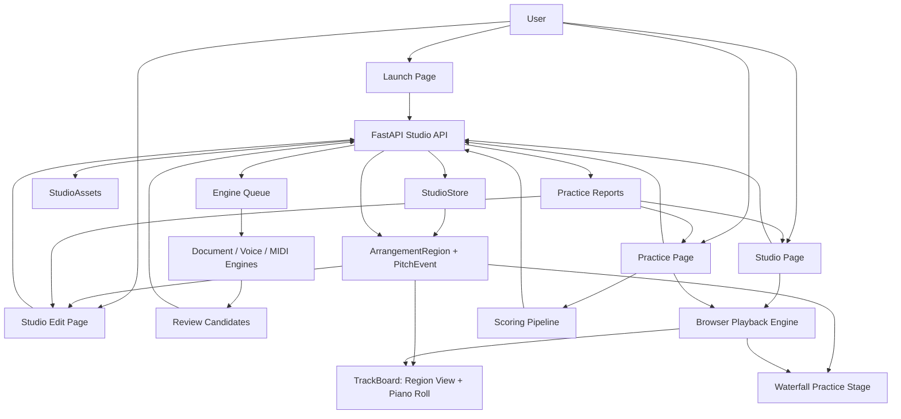

# GigaStudy Current Architecture

Date: 2026-05-06

This is the current canonical architecture after the region/piano-roll rebuild.
GigaStudy is a six-track vocal arrangement and practice workspace, not an
engraved notation editor.

## Product Center

Canonical user-facing flow:

`Studio -> Track -> Region -> PitchEvent/AudioClip -> Playback/Practice/Scoring`

Internal engine flow:

`TrackPitchEvent` lives in `gigastudy_api.domain.track_events` as an internal
extraction, registration, storage-shadow, and scoring event type. It is not a
legacy adapter and is not exported as a public contract. Internal event records
are converted to `PitchEvent`/`ArrangementRegion` for the product UI, API
response, and submitted scoring event input. When a scoring path consumes
events that were derived from `ArrangementRegion`, `TrackPitchEvent` may carry
transient report-focus metadata for the source region/event IDs; that metadata
is excluded from persistence and remains an adapter detail.

## Runtime Shape

### Web

- `apps/web/src/pages/LaunchPage.tsx`
  Creates a blank studio or seeds one from PDF/MIDI/MusicXML document input.
- `apps/web/src/pages/StudioPage.tsx`
  Owns loaded studio state, transport state, recording state, candidate review
  state, and action status for the studio assembly surface. It is the place for
  track registration, upload/record/generate, sync, selected-track playback,
  candidate review, and report history. It does not render the piano-roll
  editor, practice waterfall, or scoring controls.
- `apps/web/src/components/studio/useStudioResource.ts`
  Loads a view-specific studio payload for the current page, then uses
  `/api/studios/{id}/activity` while document, voice, generation, or scoring
  jobs are active. Activity polling carries only job state and visible counts,
  and the hook refreshes the current view once when jobs complete or
  candidate/report/registered-track counts change. Route changes abort stale
  fetches so old responses cannot overwrite the new page state. Activity
  polling has a short client timeout and backs off failures; short failures do
  not replace an in-progress notice with a red error.
- `apps/web/src/components/studio/studioNoticePresenter.ts` and
  `StudioNoticeLine.tsx`
  Convert job/activity/action state into public status notices. The presenter
  blocks implementation-language copy and only exposes progress percentages
  when a job provides actual completed/total units.
- `apps/web/src/pages/StudioEditPage.tsx`
  Dedicated region-editing surface for region selection, region structure
  actions, selected-region piano-roll editing, local draft save, and bounded
  revision restore. Report focus links land here when they carry answer
  region/event IDs.
- `apps/web/src/pages/PracticePage.tsx`
  Dedicated practice surface for selected-track playback controls, target
  selection, scoring setup/count-in, scoring capture, report feed, and the
  waterfall timing stage.
- `apps/web/src/components/studio/StudioPurposeNav.tsx`
  Shared purpose navigation for studio assembly, region editing, practice, and
  report detail surfaces. It keeps page transitions explicit and reinforces
  which work belongs on the current page.
- `apps/web/src/components/studio/StudioToolbar.tsx`
  Global transport, sync step, playback source, metronome, and selected-track
  playback controls. BPM is shown as fixed studio context, not edited after
  creation. Playback source is now audio clips or region events, not notation
  rendering.
- `apps/web/src/components/studio/useStudioPlayback.ts` and
  `apps/web/src/components/studio/studioPlaybackHelpers.ts`
  Browser playback orchestration plus pure playback-planning helpers for
  region grouping, playable track selection, sustained event merging, and
  metronome beat coverage. Long event-backed MIDI/MusicXML sessions schedule
  guide-tone events in rolling lookahead chunks instead of constructing every
  oscillator at playback start. Original-audio playback uses a bounded decoded
  `AudioBuffer` LRU keyed by studio, slot, source path, and track update time
  so repeat playback does not refetch/redecode unchanged clips.
- `apps/web/src/lib/studio/instruments.ts`
  Browser event synthesis. The default melodic event voice is a warm guide
  synth tuned to sit beside human singing instead of a sampled organ or choir
  soundfont.
- `apps/web/src/components/studio/TrackBoard.tsx`
  Main six-track arrangement component. In studio mode it renders six shared
  timeline lanes with thin pitch-positioned event minis directly on the lane,
  plus track registration/playback/sync controls. Region hit areas remain
  selectable but are not visual cards. In editor mode it renders the same six
  visible lanes plus selected-region tools and piano-roll editing. Empty tracks
  remain visible as lanes with no event minis. Practice waterfall rendering
  belongs to `PracticePage`.
- `apps/web/src/components/studio/TrackArchiveDialog.tsx`
  Restore-only track material archive dialog. It is opened from a track row
  only when inactive snapshots exist, labels pinned score material as original
  score, and restores by replacing the active track material after confirming
  that the current material will be archived first.
- `apps/web/src/components/studio/eventMiniLayout.ts`
  Shared event-mini presentation helper for filtering renderable events,
  positioning minis by pitch, sizing dense lanes by pitch span, and generating
  hover/accessibility labels with pitch name, start, and duration. Track-board,
  region editor, and practice waterfall views use the same thin-bar contract so
  short MIDI events do not become oversized overlapping pills. Event mini width
  is proportional to the visible shared timeline duration; pitch affects only
  the vertical position, not the bar thickness.
- `apps/web/src/components/studio/TrackBoardTimeline.tsx` and
  `apps/web/src/components/studio/TrackBoardTimelineLayout.ts`
  Waterfall practice preview rendering plus shared track-board timeline math,
  fixed beat-width scaling, and region lane positioning. Studio lanes,
  selected-region piano roll, and practice waterfall use 50 pixels per
  quarter-note beat so BPM changes playhead speed rather than visual measure
  width. TrackBoard uses these helpers instead of owning timeline layout
  details inline.
- `apps/web/src/components/studio/TrackBoardEditor.tsx` and
  `apps/web/src/components/studio/TrackBoardEditorGrid.ts`
  Region and pitch-event editing controls for the selected arrangement region.
  The editor exposes direct numeric fields for region track/start/duration and
  selected-event pitch/start/duration, keeps detailed edits in a local draft,
  persists unsaved drafts in browser session storage across studio sub-page
  navigation, saves them through one region revision command, and reads bounded
  restore history from region diagnostics.
- `apps/web/src/lib/studio/regions.ts`
  Region utility helpers only. The web client consumes region payloads and must
  not rebuild product regions from internal storage event arrays. Timeline
  bounds can extend before 0 seconds so user-visible sync/early entrances are
  displayed rather than clamped onto the downbeat.

### API

- `apps/api/src/gigastudy_api/api/routes/studios.py`
  FastAPI studio command/query endpoints, including single-field region/event
  mutation endpoints and the batch region revision save/restore endpoints used
  by the region editor. Job polling has a lightweight activity endpoint that
  omits regions, candidates, reports, and archive detail and does not schedule
  recovery or processing work. Track volume can return a minimal patch response
  for live mix commits while the legacy full response remains the default.
  `GET /studios/{id}?view=studio|edit|practice` trims candidate/report detail
  for page loads, while candidate and report detail endpoints serve large
  review/evidence payloads lazily.
- `apps/api/src/gigastudy_api/services/studio_repository.py`
  Facade over storage, asset, queue, upload, candidate, generation, scoring,
  and resource services.
- `apps/api/src/gigastudy_api/api/schemas/studios.py`
  Internal storage plus public response contracts. `Studio.regions` is the
  product arrangement truth. New registration writes explicit
  `ArrangementRegion` data and clears `TrackSlot.events`; track event shadows
  are retained only as migration fallbacks for older payloads and as bounded
  internal inputs before registration. `ExtractionCandidate.events` remains a
  candidate-review shadow until approval. They accept only the current event
  shape; obsolete pre-region payloads are rejected with the rest of the obsolete
  storage shape. `Studio.track_material_archives` is loaded into the internal
  model from a storage sidecar and stores inactive restore snapshots for
  overwritten track material. Each archive stores `region_snapshots[]`, with old
  single `region_snapshot` payloads lazily migrated on read. Studio routes
  return `StudioResponse`, whose tracks and candidates omit internal event
  arrays and whose archive payload exposes summaries only, not stored event
  snapshots. `TrackExtractionJob.progress` is optional and represents
  user-facing stage/progress evidence; percent-capable fields are set only when
  the job has real completed/total units. Non-full response views keep reports
  as summaries and candidates
  as metadata plus empty preview regions until a detail endpoint is requested.
  `StudioResponse.regions` and `ExtractionCandidateResponse.region` expose the
  arrangement data flow. Document imports use `source_kind: "document"`;
  `"score"` is no longer accepted as a source-kind alias. `PitchEvent` carries
  timing, source, extraction method, measure position, and quality warnings so
  consumers do not need storage shadows for product behavior. Scoring reports
  expose event IDs and event counts only.
- `apps/api/src/gigastudy_api/domain/track_events.py`
  Internal pitch-event adapter for extraction, registration, persistence, and
  scoring. `TrackPitchEvent` belongs here instead of the API schema module.
- `apps/api/src/gigastudy_api/services/engine/event_normalization.py`
  Internal pitch-event preparation helpers for timing quantization, range
  metadata, spelling, measure positions, and same-pitch contiguous fragment
  merging. It exposes the beat-derived sixteenth-note unit used by automatic
  registration, so cleanup is tied to BPM/meter rather than fixed seconds.
- `apps/api/src/gigastudy_api/services/engine/registration_policy.py`
  Shared automatic-registration policy. MIDI, MusicXML/PDF-derived material,
  voice/audio transcription, and AI-generated candidates use it for
  BPM/meter-derived grid size, minimum event length, same-pitch merge gap, and
  micro-gap absorption. Manual editing, sync, playback, and scoring do not
  apply this policy unless the user explicitly saves a registration-style
  rewrite.
- `apps/api/src/gigastudy_api/services/studio_region_commands.py`
  Manual region editing, split/copy, save, and revision restore preserve the
  user's explicit event fragments. They normalize IDs and timing fields but do
  not apply registration-only same-pitch merging.
- `apps/api/src/gigastudy_api/services/engine/event_quality.py`
  The registration quality gate before extracted material becomes product
  regions. It replaces the old notation quality layer. The final registration
  contract forces recording, audio upload, MIDI/MusicXML/document import, and
  AI-generated material onto the current BPM/meter-derived sixteenth-note unit,
  merges same-pitch fragments, and absorbs import/export micro-gaps below that
  unit while preserving real gaps and exempting sync, scoring, and manual region
  editing.
  Studio storage/edit precision remains 0.001 seconds; registration rhythm
  normalization and storage precision are separate contracts.
- `apps/api/src/gigastudy_api/services/engine/voice.py`
  Voice pitch extraction with Basic Pitch/librosa/local fallback, fixed-BPM
  metronome phase alignment, strict sung-segment cleanup, and a narrow rescue
  pass for short stable sung contours. Rescued material is marked in event
  warnings and diagnostics.
- `apps/api/src/gigastudy_api/services/studio_repository.py`
  Wraps voice transcription with a small in-process fingerprint cache keyed by
  audio bytes, BPM/meter, slot, engine identity, and extraction-plan
  diagnostics. This avoids repeating expensive voice analysis for identical
  retries without making cached results part of product truth.
- `apps/api/src/gigastudy_api/services/engine/audio_decode.py`
  Server-side audio normalization for voice analysis. Track recording uploads
  may arrive as WAV/MP3/M4A/OGG/FLAC, but non-WAV files are decoded through
  ffmpeg into temporary WAV before the voice engine runs. Studio-start uploads
  are score/document sources only, not music audio. When a retained audio clip
  was decoded or aligned, `studio_assets` writes a normalized WAV asset and
  exposes that path/MIME to playback instead of pointing a track at mismatched
  original bytes.
- `apps/api/src/gigastudy_api/services/document_extraction_pipeline.py` and
  `apps/api/src/gigastudy_api/services/studio_engine_job_handlers.py`
  Shared queued import path for studio-start score files. PDF/image inputs run
  Audiveris or vector fallback and produce review candidates. MIDI, MusicXML,
  MXL, and XML inputs are parsed directly in the same engine queue; clear
  singer-line results register to regions, while ambiguous symbolic material
  becomes review candidates. Studio-start score files first create a
  `tempo_review_required` job with suggested BPM/meter diagnostics. Only after
  user approval does the API enqueue the document job, and the approved studio
  BPM/meter is passed through the registration path; source-file tempo is
  evidence, not an automatic override.
- `apps/api/src/gigastudy_api/services/studio_tempo_review.py`
  Reads light BPM/meter evidence from symbolic score files before registration
  starts. PDF/image inputs cannot reliably expose tempo at this stage, so the
  helper keeps the fallback values and tells the UI that user confirmation is
  required.
- `apps/api/src/gigastudy_api/services/engine/symbolic.py`
  MusicXML/MIDI parsing and track-to-slot mapping. MIDI parsing splits
  channel-packed tracks into per-channel parsed parts, records MIDI program/name
  diagnostics, then characterizes each part by musical role. Pitched
  singer-like parts are assigned by relative register and range fit, so generic
  staff names can still become soprano/alto/tenor/baritone/bass material.
  Channel-10 or clearly special rhythmic parts map to percussion. Candidate
  review is kept for parts that still look like accompaniment, overly broad
  special-purpose material, or otherwise ambiguous non-vocal content after
  characterization.
- `apps/api/src/gigastudy_api/services/registration_context.py`
  The single provider for region-aware registration context. Registration
  cleanup, LLM review, and ensemble gates use this instead of reading
  `TrackSlot.events` directly.
- `apps/api/src/gigastudy_api/services/engine/report_focus.py`
  Maps internal scoring events back to public region/event IDs for report
  deep-links.
- `apps/api/src/gigastudy_api/services/llm/registration_review.py`
  Optional bounded LLM review for registration cleanup; the model can only
  choose deterministic repair directives and cannot author canonical events.
- `apps/api/src/gigastudy_api/services/llm/midi_role_review.py`
  Optional bounded LLM review for ambiguous MIDI singer-role assignment. It
  receives compact per-part name/channel/program/range/polyphony summaries and
  may choose existing visible slots or mark an existing part for candidate
  review. It cannot create tracks, delete events, rewrite pitch material, or
  change BPM/meter; invalid or low-confidence responses are ignored.
- LLM provider calls are an adapter boundary. DeepSeek/OpenRouter may be the
  current low-cost implementation, but product services should depend on
  bounded review/planning functions rather than provider internals.
- `apps/api/src/gigastudy_api/services/studio_store.py`
  Studio persistence abstraction. Base studio payloads are kept small by
  sidecar-storing reports, candidates, and track material archives; concurrent
  saves merge archive rows by `archive_id` so restore history is not lost by a
  racing save. Backends are local JSON, Postgres, or R2/S3 JSON metadata under
  the configured metadata prefix.
- `apps/api/src/gigastudy_api/services/metadata_object_store.py`
  Small S3-compatible JSON object adapter used by R2 metadata stores, the
  engine queue, asset registry, and playback-instrument config.
- `apps/api/src/gigastudy_api/services/studio_assets.py`
  Asset path, local/S3 storage, direct-upload lifecycle, staged cleanup, and
  bounded deletion of unreferenced studio assets.
- `apps/api/src/gigastudy_api/services/engine_queue.py`
  Durable local/Postgres/R2 queue for document import, voice extraction, AI
  generation, and scoring analysis work.
- `apps/api/src/gigastudy_api/services/performance.py`
  Per-request timing collector used by API middleware and store/response
  builders. Slow request logs include total time, store load/save time,
  response-build time, engine-job time when available, and payload lengths.

## Data Flow

### Studio Load

1. Web calls `GET /api/studios/{studio_id}?view=studio|edit|practice` for page
   loads, or `view=full` only for compatibility/admin-style needs.
2. API loads a `Studio` from `StudioStore`; activity polling uses a summary
   read that avoids full sidecar/detail merge.
3. API builds a `StudioResponse`, stripping internal event shadows from tracks
   and candidates, exposing only track material archive summaries, and trimming
   report/candidate detail on non-full views.
4. `StudioResponse.regions` uses persisted explicit regions and derives a
   fallback region from registered track event shadows only for older payloads
   that have not yet been saved through the explicit-region path.
5. Web passes `studio.regions` into `TrackBoard`, `StudioEditPage`, playback,
   report focus, and practice waterfall surfaces.
6. Studio assembly, region editing, playback, candidate review, practice
   waterfall, and practice scoring consume pitch events from the same region
   payload while staying on separate purpose-specific pages. All three visible
   track surfaces keep the six track slots present; empty tracks have lanes
   without event minis.
7. The region editor may keep unsaved draft edits in browser session storage
   while the user moves between studio sub-pages. Only `Save` mutates
   `Studio.regions`, so other pages continue to reflect the last saved product
   timeline; the API records the pre-save region material as a bounded restore
   point in `ArrangementRegion.diagnostics.region_editor`.
8. Lightweight UI choices stay local until commit. Candidate target choices,
   overwrite checkboxes, tempo drafts, playback selection, recording-reference
   selection, and live volume preview do not call the API until the user
   approves, saves, registers, scores, restores, or commits the volume value.

### Upload / Import

1. Web requests an upload target. Studio creation exposes `PDF/MIDI/MusicXML`
   score-file seeding, while each track row exposes recording-file upload for
   audio extraction.
2. Browser sends the file via direct upload or inline fallback. Local
   direct-upload requests are streamed to storage instead of buffered in memory.
   Studio creation requests include a browser-generated `client_request_id`; if the browser
   loses the response and retries the same start data, the API returns the
   existing studio instead of creating a duplicate.
3. For score-file studio starts, API creates a `tempo_review_required` job and
   keeps tracks empty. The user confirms or edits BPM/meter; approval updates
   the studio clock and enqueues registration. If an approved queued/running
   import job loses its durable queue record, retry repairs the queue record and
   schedules processing again.
4. API either registers clearly assigned symbolic seed parts directly or creates
   an extraction job/candidate review path for ambiguous material. Audio
   extraction first normalizes non-WAV containers into a WAV analysis source.
5. Engine queue runs document/audio extraction when asynchronous extraction is
   needed.
6. Extracted or ambiguous material becomes reviewable candidates with
   candidate-region previews.
7. User approval registers candidates into explicit target-track regions and
   clears target track event shadows. Bulk document approval registers every
   unblocked valid part it can, leaves overwrite-blocked or failed parts
   reviewable, and records the per-track outcome on the extraction job.
8. If registration overwrites an existing track, API stores the previous active
   material as an inactive track archive before replacing `Studio.regions`.
   Original MIDI/MusicXML/PDF score material is pinned for that slot. Restore
   first archives the current active material, then replaces all active regions
   for the slot with the archived snapshots.
9. Reloaded studio response exposes the registered track from `Studio.regions`.

### Recording

1. User clicks a track's recording control and chooses audible references for
   that take: the six visible tracks remain listed, registered tracks can be
   enabled, empty tracks are shown but disabled, and the metronome can be
   toggled separately.
2. Browser opens the microphone before the downbeat, then schedules selected
   reference tracks and the metronome against studio timeline `0` so the
   count-in and reference playback share one downbeat.
3. If no reference tracks are selected, the browser keeps the existing
   count-in-only path: metronome if selected, or silent visual count-in if not.
4. The stopped take stays pending until the user registers or discards it.
5. Registration uses direct upload for the pending take when available, falling
   back to base64 JSON only if direct upload fails. API stores retained audio
   and starts voice extraction after registration.
6. Extracted pitch material becomes a candidate or registered track. If the
   target slot already had score/imported/generated material, the active
   material is archived before the recording replaces it.
7. Region and pitch-event views update from the studio response.

### Scoring

1. User opens scoring from the Practice page after choosing the target part.
2. Reference tracks and metronome are selected in the scoring drawer; reference
   selection is scoring input, while audible reference playback is practice UX.
3. Browser records a take while selected audible references play on the shared
   scheduled timeline.
4. Browser submits recorded audio by temporary direct upload when available, or
   falls back to base64 JSON; it may also submit `performance_events`.
5. API stores a scoring job and returns quickly. The engine queue converts
   submitted performance events or uploaded audio to the internal pitch-event
   adapter.
6. Scoring compares those events with registered arrangement regions, preserving
   public answer-region focus IDs through the internal adapter boundary.
7. Report summaries appear in the studio/practice feed after activity polling;
   the report detail endpoint returns issue/evidence detail on demand.
8. Report detail links can reopen the region editor with query parameters that
   focus the matching region and piano-roll event.

### AI Generation

1. User asks a target track to generate from registered context tracks.
2. API stores a generation job and returns quickly. The engine queue uses
   deterministic harmony generation plus optional bounded LLM planning.
3. The generator searches a slightly larger candidate pool, normalizes the
   results, selects the most distinct candidates for review, and records context
   and diversity diagnostics.
4. Generated candidates pass the shared registration rhythm contract before
   review, so candidate and approved events use the same BPM/meter-derived
   readable grid as imported material.
5. Generated candidates remain reviewable until approved.
6. Approved material becomes a region in the target track.
7. If approval overwrites an active target track, the overwritten material is
   archived first; generation, playback, and scoring still consume only the
   restored or newly active `Studio.regions`.

### Playback

1. Toolbar or track controls choose source mode.
2. Audio mode prefers retained audio clips when present.
3. Event mode synthesizes playable events from `ArrangementRegion.pitch_events`
   with the warm guide tone by default. If admin has uploaded a custom guide
   sample, melodic event synthesis may use that sample transposed from its
   configured root MIDI pitch; otherwise it falls back to the built-in synth.
   Dense MIDI-style event sessions are scheduled by lookahead chunks against
   the shared scheduled start so browser oscillator load does not mute playback.
   Playback uses persisted event durations within studio precision and does not
   stretch events to the registration rhythm grid. Custom guide instrument
   configuration is cached briefly, while decoded original-audio buffers are
   cached until the source path or track update time changes.
4. Sync offset and volume are applied per track. Negative sync is preserved as
   a user-visible timeline translation; barlines stay on the shared grid.
5. Audio clips are scheduled from `TrackSlot.sync_offset_seconds`. Region pitch
   events are scheduled from public `PitchEvent.start_seconds`, which is already
   sync-resolved at the API boundary.
6. Playhead state drives region lane timing on the studio surface and
   waterfall visual timing on the practice surface.

### Export

1. Studio exports currently provide a MIDI file built from the public
   `Studio.regions` timeline.
2. Export creates one tempo track plus six visible track chunks so empty lanes
   remain represented, while note events are written only for registered
   pitch-event material.
3. Negative effective starts are shifted together at export time so exported
   MIDI begins at tick 0 without changing inter-track timing.
4. Project JSON and audio mix export are future contracts. They must export the
   public region/event timeline and restored active material only, not inactive
   archives or internal `TrackPitchEvent` shadows.

## Removed Surface

- Browser VexFlow rendering.
- Engraved notation strip components.
- Notation-specific rendering helpers.
- PDF export endpoint and reportlab dependency.
- Foundation documents that described the old notation UI as canonical.

## Preserved Assets

- FastAPI/Vite application shells.
- Upload, asset, owner-token, admin, storage, direct-upload, and queue systems.
- Audio recording and playback primitives.
- Voice pitch extraction math.
- MIDI/MusicXML/PDF import adapters as extraction inputs.
- MIDI export from region/event timeline.
- Candidate review, diagnostics, AI generation, scoring, and report history.

## Architecture Fitness Check

The rebuild now follows the intended separation:

- Product truth: `Studio.regions`, `ArrangementRegion.pitch_events`, and
  `CandidateRegion.pitch_events`.
- Restore snapshots: `Studio.track_material_archives` is inactive storage for
  restoration only, stored outside the base studio payload, and is not consumed
  by playback, scoring, practice, or AI generation. Pinned original score
  snapshots remain; non-pinned restore snapshots keep the latest 3 per slot.
- Alpha persistence: in R2 metadata mode, new studios, sidecars, queue state,
  asset registry, and custom guide-tone config are stored in object storage
  under `metadata/`. Cloud Run local disk remains cache/temp space.
- Product surfaces: region lanes, selected-region piano roll, waterfall
  practice, playback, and report focus consume region/event payloads only.
- Bounded adapters: document, MIDI, PDF, voice, AI generation, registration,
  and scoring can use `TrackPitchEvent` internally, then publish explicit
  regions. Saved registered material should not keep a parallel
  `TrackSlot.events` truth.
- Active material checks: overwrite guards, queued placeholders, candidate
  approval, generation, and job recovery check active `Studio.regions` first,
  then only use legacy track shadows/audio metadata as a migration fallback.
- No obsolete compatibility path: obsolete pre-region storage arrays, deprecated document source aliases,
  and old report comparison IDs/counts are rejected
  rather than translated.
- Responsibility split: schemas own public/private contracts; repository and
  command services orchestrate persistence and workflows; engines own
  extraction, normalization, registration quality, generation, and scoring;
  web consumes the public region contract.

## Remaining Boundaries

These are accepted residuals, not legacy UI anchors:

- Report focus targets persisted answer regions. Performance-take focus remains
  report-local until recorded takes become explicit persisted performance
  regions.
- PDF/MusicXML/MIDI ingestion should stay behind document-extraction naming and
  never reintroduce notation rendering as a product surface.
