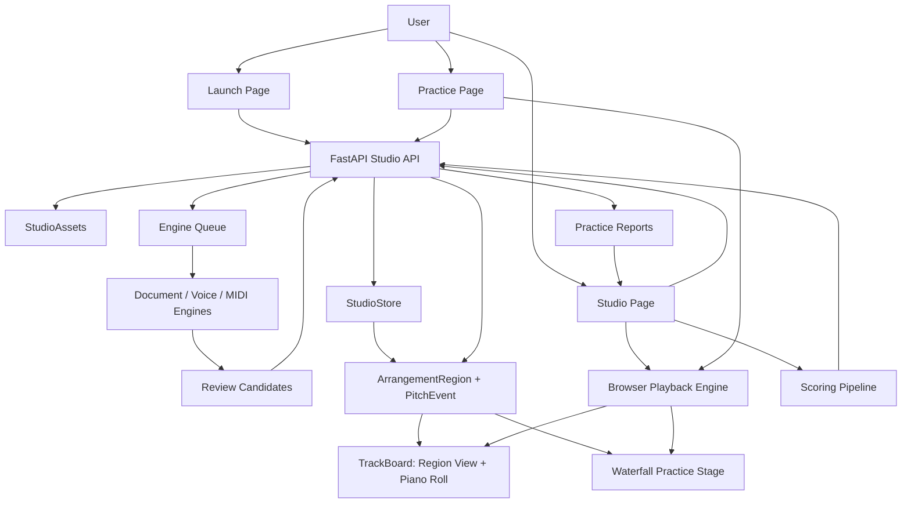

# GigaStudy Current Architecture

Date: 2026-05-02

This is the current canonical architecture after the region/piano-roll rebuild.
GigaStudy is a six-track vocal arrangement and practice workspace, not an
engraved notation editor.

## Product Center

Canonical user-facing flow:

`Studio -> Track -> Region -> PitchEvent/AudioClip -> Playback/Practice/Scoring`

Internal engine flow:

`TrackPitchEvent` lives in `gigastudy_api.domain.track_events` as an internal
extraction, registration, storage-shadow, and scoring event type. It is not a
legacy adapter and is not exported as a public contract. Internal event records
are converted to `PitchEvent`/`ArrangementRegion` for the product UI, API
response, and submitted scoring event input. When a scoring path consumes
events that were derived from `ArrangementRegion`, `TrackPitchEvent` may carry
transient report-focus metadata for the source region/event IDs; that metadata
is excluded from persistence and remains an adapter detail.

## Runtime Shape

### Web

- `apps/web/src/pages/LaunchPage.tsx`
  Creates a blank studio or seeds one from document/music input.
- `apps/web/src/pages/StudioPage.tsx`
  Owns loaded studio state, transport state, recording state, scoring state,
  candidate review state, and action status.
- `apps/web/src/components/studio/StudioToolbar.tsx`
  Global transport, sync step, playback source, metronome, and selected-track
  playback controls. Playback source is now audio clips or region events, not
  notation rendering.
- `apps/web/src/components/studio/useStudioPlayback.ts` and
  `apps/web/src/components/studio/studioPlaybackHelpers.ts`
  Browser playback orchestration plus pure playback-planning helpers for
  region grouping, playable track selection, sustained event merging, and
  metronome beat coverage.
- `apps/web/src/components/studio/TrackBoard.tsx`
  Main arrangement surface and track command composer. It renders:
  - macro region lanes for all six tracks,
  - a selected-region piano roll,
  - a waterfall practice preview.
- `apps/web/src/components/studio/TrackBoardTimeline.tsx` and
  `apps/web/src/components/studio/TrackBoardTimelineLayout.ts`
  Waterfall practice preview rendering plus shared track-board timeline math
  and region lane positioning. TrackBoard uses these instead of owning timeline
  layout details inline.
- `apps/web/src/components/studio/TrackBoardEditor.tsx` and
  `apps/web/src/components/studio/TrackBoardEditorGrid.ts`
  Region and pitch-event editing controls for the selected arrangement region,
  including piano-roll event positioning and beat-grid snap helpers.
- `apps/web/src/lib/studio/regions.ts`
  Region utility helpers only. The web client consumes region payloads and must
  not rebuild product regions from internal storage event arrays. Timeline
  bounds can extend before 0 seconds so user-visible sync/early entrances are
  displayed rather than clamped onto the downbeat.

### API

- `apps/api/src/gigastudy_api/api/routes/studios.py`
  FastAPI studio command/query endpoints.
- `apps/api/src/gigastudy_api/services/studio_repository.py`
  Facade over storage, asset, queue, upload, candidate, generation, scoring,
  and resource services.
- `apps/api/src/gigastudy_api/api/schemas/studios.py`
  Internal storage plus public response contracts. `Studio.regions` is the
  product arrangement truth. New registration writes explicit
  `ArrangementRegion` data and clears `TrackSlot.events`; track event shadows
  are retained only as migration fallbacks for older payloads and as bounded
  internal inputs before registration. `ExtractionCandidate.events` remains a
  candidate-review shadow until approval. They accept only the current event
  shape; obsolete pre-region payloads are rejected with the rest of the obsolete
  storage shape. Studio routes return `StudioResponse`, whose tracks and
  candidates omit internal event arrays.
  `StudioResponse.regions` and `ExtractionCandidateResponse.region` expose the
  arrangement data flow. Document imports use `source_kind: "document"`;
  `"score"` is no longer accepted as a source-kind alias. `PitchEvent` carries
  timing, source, extraction method, measure position, and quality warnings so
  consumers do not need storage shadows for product behavior. Scoring reports
  expose event IDs and event counts only.
- `apps/api/src/gigastudy_api/domain/track_events.py`
  Internal pitch-event adapter for extraction, registration, persistence, and
  scoring. `TrackPitchEvent` belongs here instead of the API schema module.
- `apps/api/src/gigastudy_api/services/engine/event_normalization.py`
  Internal pitch-event preparation helpers for timing quantization, range
  metadata, spelling, and measure positions.
- `apps/api/src/gigastudy_api/services/engine/event_quality.py`
  The registration quality gate before extracted material becomes product
  regions. It replaces the old notation quality layer.
- `apps/api/src/gigastudy_api/services/registration_context.py`
  The single provider for region-aware registration context. Registration
  cleanup, LLM review, and ensemble gates use this instead of reading
  `TrackSlot.events` directly.
- `apps/api/src/gigastudy_api/services/engine/report_focus.py`
  Maps internal scoring events back to public region/event IDs for report
  deep-links.
- `apps/api/src/gigastudy_api/services/llm/registration_review.py`
  Optional bounded LLM review for registration cleanup; the model can only
  choose deterministic repair directives and cannot author canonical events.
- `apps/api/src/gigastudy_api/services/studio_store.py`
  Studio persistence abstraction.
- `apps/api/src/gigastudy_api/services/studio_assets.py`
  Asset path, local/S3 storage, and direct-upload lifecycle.
- `apps/api/src/gigastudy_api/services/engine_queue.py`
  Durable local/Postgres queue for extraction work.

## Data Flow

### Studio Load

1. Web calls `GET /api/studios/{studio_id}`.
2. API loads a `Studio` from `StudioStore`.
3. API builds a `StudioResponse`, stripping internal event shadows from tracks
   and candidates.
4. `StudioResponse.regions` uses persisted explicit regions and derives a
   fallback region from registered track event shadows only for older payloads
   that have not yet been saved through the explicit-region path.
5. Web passes `studio.regions` into `TrackBoard`.
6. `TrackBoard`, playback, candidate review, and practice waterfall consume
   pitch events from the same region payload.

### Upload / Import

1. Web requests an upload target.
2. Browser sends the file via direct upload or inline fallback.
3. API creates an extraction job.
4. Engine queue runs document/audio/MIDI extraction.
5. Extracted material becomes reviewable candidates with candidate-region
   previews.
6. User approval registers the candidate into an explicit target-track region
   and clears the target track event shadow.
7. Reloaded studio response exposes the registered track from `Studio.regions`.

### Recording

1. Browser records audio with a count-in tied to the studio clock.
2. API stores retained audio and starts voice extraction.
3. Extracted pitch material becomes a candidate or registered track.
4. Region and pitch-event views update from the studio response.

### Scoring

1. Browser submits recorded audio or `performance_events`.
2. API converts submitted performance events to the internal pitch-event adapter.
3. Scoring compares those events with registered arrangement regions, preserving
   public answer-region focus IDs through the internal adapter boundary.
4. Reports return region/event IDs that can focus the piano roll.

### AI Generation

1. User asks a target track to generate from registered context tracks.
2. API uses deterministic harmony generation plus optional bounded LLM planning.
3. Generated candidates remain reviewable until approved.
4. Approved material becomes a region in the target track.

### Playback

1. Toolbar or track controls choose source mode.
2. Audio mode prefers retained audio clips when present.
3. Event mode synthesizes playable events from `ArrangementRegion.pitch_events`.
4. Sync offset and volume are applied per track. Negative sync is preserved as
   a user-visible timeline translation; barlines stay on the shared grid.
5. Playhead state drives region lane and waterfall visual timing.

### Scoring

1. User opens scoring from a target track.
2. Reference tracks and metronome are selected.
3. Browser records a take while selected references play.
4. API extracts the take and compares pitch/timing against the target or
   harmony context.
5. Report issues include region/event IDs and expected/actual beat coordinates.
6. Report detail links can reopen the studio with query parameters that focus
   the matching region and piano-roll event.

## Removed Surface

- Browser VexFlow rendering.
- Engraved notation strip components.
- Notation-specific rendering helpers.
- PDF export endpoint and reportlab dependency.
- Foundation documents that described the old notation UI as canonical.

## Preserved Assets

- FastAPI/Vite application shells.
- Upload, asset, owner-token, admin, storage, direct-upload, and queue systems.
- Audio recording and playback primitives.
- Voice pitch extraction math.
- MIDI/MusicXML/PDF import adapters as extraction inputs.
- Candidate review, diagnostics, AI generation, scoring, and report history.

## Architecture Fitness Check

The rebuild now follows the intended separation:

- Product truth: `Studio.regions`, `ArrangementRegion.pitch_events`, and
  `CandidateRegion.pitch_events`.
- Product surfaces: region lanes, selected-region piano roll, waterfall
  practice, playback, and report focus consume region/event payloads only.
- Bounded adapters: document, MIDI, PDF, voice, AI generation, registration,
  and scoring can use `TrackPitchEvent` internally, then publish explicit
  regions. Saved registered material should not keep a parallel
  `TrackSlot.events` truth.
- No obsolete compatibility path: obsolete pre-region storage arrays, deprecated document source aliases,
  and old report comparison IDs/counts are rejected
  rather than translated.
- Responsibility split: schemas own public/private contracts; repository and
  command services orchestrate persistence and workflows; engines own
  extraction, normalization, registration quality, generation, and scoring;
  web consumes the public region contract.

## Remaining Boundaries

These are accepted residuals, not legacy UI anchors:

- Report focus targets persisted answer regions. Performance-take focus remains
  report-local until recorded takes become explicit persisted performance
  regions.
- PDF/MusicXML/MIDI ingestion should stay behind document-extraction naming and
  never reintroduce notation rendering as a product surface.
