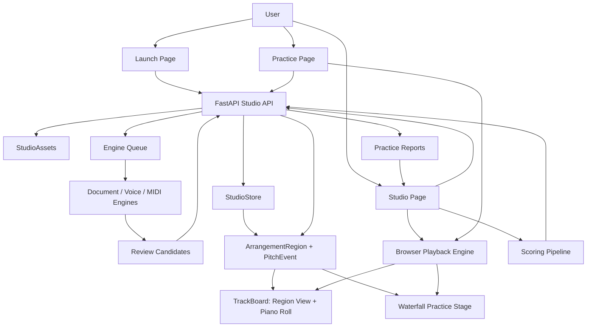

# GigaStudy Current Architecture

Date: 2026-05-02

This is the current canonical architecture after the staff-notation reset.
GigaStudy is a six-track vocal arrangement and practice workspace, not an
engraved-score editor.

## Product Center

Canonical user-facing flow:

`Studio -> Track -> Region -> PitchEvent/AudioClip -> Playback/Practice/Scoring`

Compatibility flow:

`TrackNote` still exists as an import and scoring compatibility shape while old
engines are being migrated. It is converted to `PitchEvent`/`ArrangementRegion`
for the product UI and API response.

## Runtime Shape

### Web

- `apps/web/src/pages/LaunchPage.tsx`
  Creates a blank studio or seeds one from document/music input.
- `apps/web/src/pages/StudioPage.tsx`
  Owns loaded studio state, transport state, recording state, scoring state,
  candidate review state, and action status.
- `apps/web/src/components/studio/StudioToolbar.tsx`
  Global transport, sync step, playback source, metronome, and selected-track
  playback controls. Playback source is now audio clips or region events, not
  score rendering.
- `apps/web/src/components/studio/TrackBoard.tsx`
  Main arrangement surface. It renders:
  - macro region lanes for all six tracks,
  - a selected-region piano roll,
  - a waterfall practice preview.
- `apps/web/src/lib/studio/regions.ts`
  Frontend fallback adapter from legacy `TrackSlot.notes` to
  `ArrangementRegion` and `PitchEvent`. Normal rendering and playback prefer
  `studio.regions` from the API.

### API

- `apps/api/src/gigastudy_api/api/routes/studios.py`
  FastAPI studio command/query endpoints.
- `apps/api/src/gigastudy_api/services/studio_repository.py`
  Facade over storage, asset, queue, upload, candidate, generation, scoring,
  and resource services.
- `apps/api/src/gigastudy_api/api/schemas/studios.py`
  Public contract. `Studio.regions` and `ExtractionCandidate.region` expose the
  arrangement data flow. Document imports use `source_kind: "document"`; legacy
  `"score"` input is accepted only as a compatibility alias and normalized at
  the API boundary.
- `apps/api/src/gigastudy_api/services/studio_store.py`
  Studio persistence abstraction.
- `apps/api/src/gigastudy_api/services/studio_assets.py`
  Asset path, local/S3 storage, and direct-upload lifecycle.
- `apps/api/src/gigastudy_api/services/engine_queue.py`
  Durable local/Postgres queue for extraction work.

## Data Flow

### Studio Load

1. Web calls `GET /api/studios/{studio_id}`.
2. API loads a `Studio` from `StudioStore`.
3. `Studio.regions` is computed from registered tracks.
4. Web passes `studio.regions` into `TrackBoard`.
5. `TrackBoard`, playback, candidate review, and practice waterfall consume
   pitch events from the same region payload.

### Upload / Import

1. Web requests an upload target.
2. Browser sends the file via direct upload or inline fallback.
3. API creates an extraction job.
4. Engine queue runs document/audio/MIDI extraction.
5. Extracted material becomes reviewable candidates with candidate-region
   previews.
6. User approval registers the candidate into a track.
7. Reloaded studio response exposes the registered track as a region.

### Recording

1. Browser records audio with a count-in tied to the studio clock.
2. API stores retained audio and starts voice extraction.
3. Extracted pitch material becomes a candidate or registered track.
4. Region and pitch-event views update from the studio response.

### AI Generation

1. User asks a target track to generate from registered context tracks.
2. API uses deterministic harmony generation plus optional bounded LLM planning.
3. Generated candidates remain reviewable until approved.
4. Approved material becomes a region in the target track.

### Playback

1. Toolbar or track controls choose source mode.
2. Audio mode prefers retained audio clips when present.
3. Event mode synthesizes playable events from `ArrangementRegion.pitch_events`.
4. Sync offset and volume are applied per track.
5. Playhead state drives region lane and waterfall visual timing.

### Scoring

1. User opens scoring from a target track.
2. Reference tracks and metronome are selected.
3. Browser records a take while selected references play.
4. API extracts the take and compares pitch/timing against the target or
   harmony context.
5. Report issues include region/event IDs and expected/actual beat coordinates.
6. Report detail links can reopen the studio with query parameters that focus
   the matching region and piano-roll event.

## Removed Surface

- Browser VexFlow rendering.
- Engraved score strip components.
- Staff-specific score rendering helpers.
- Staff PDF export endpoint and reportlab dependency.
- Foundation documents that described the old staff UI as canonical.

## Preserved Assets

- FastAPI/Vite application shells.
- Upload, asset, owner-token, admin, storage, direct-upload, and queue systems.
- Audio recording and playback primitives.
- Voice pitch extraction math.
- MIDI/MusicXML/PDF import adapters as extraction inputs.
- Candidate review, diagnostics, AI generation, scoring, and report history.

## Next Internal Migration

The remaining compatibility layer is mostly naming and storage shape:

- `TrackNote` should become an internal import/scoring adapter.
- Persistent studio state should eventually store explicit regions/events.
- Candidate note arrays should remain compatibility payload only; candidate
  review must use `ExtractionCandidate.region`.
- Report focus currently targets persisted answer regions. Performance-take
  focus should be expanded after recorded takes become explicit persisted
  regions instead of report-local comparison payloads.
- PDF/MusicXML/MIDI ingestion should stay behind document-extraction naming and
  never reintroduce staff rendering as a product surface.
