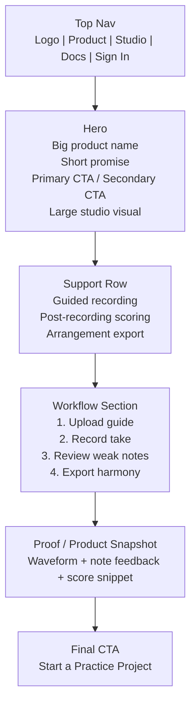
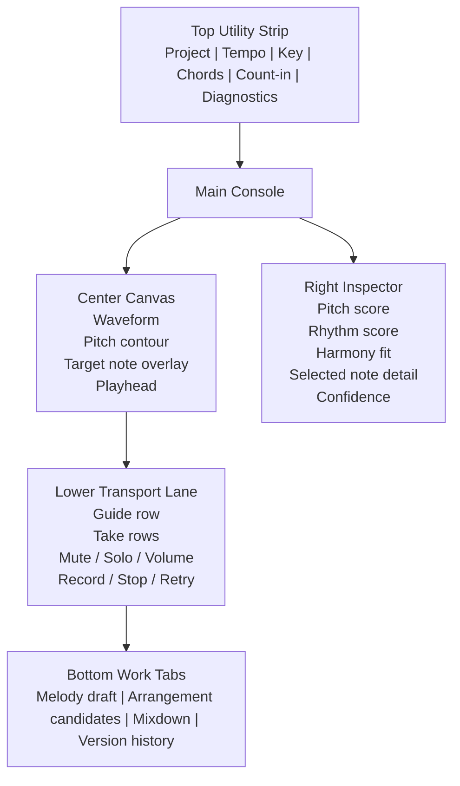
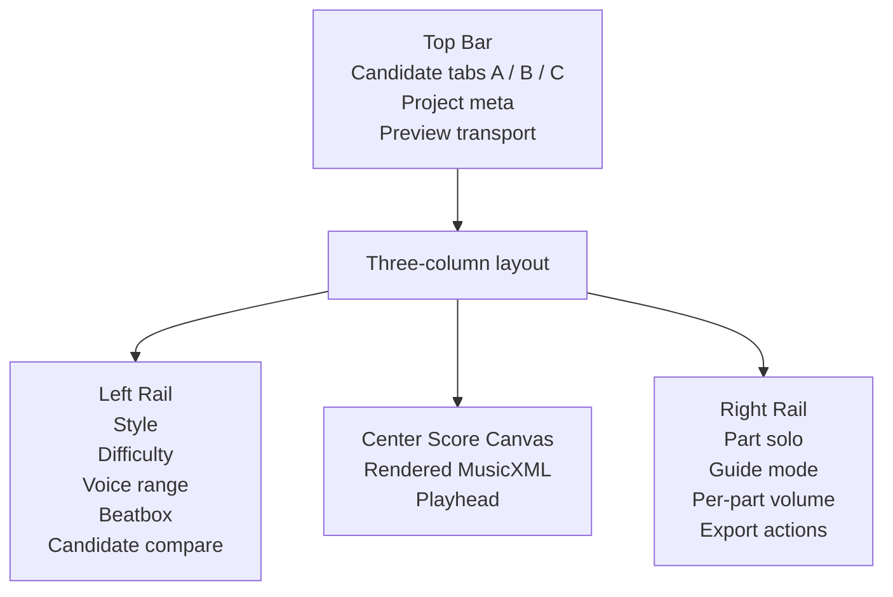
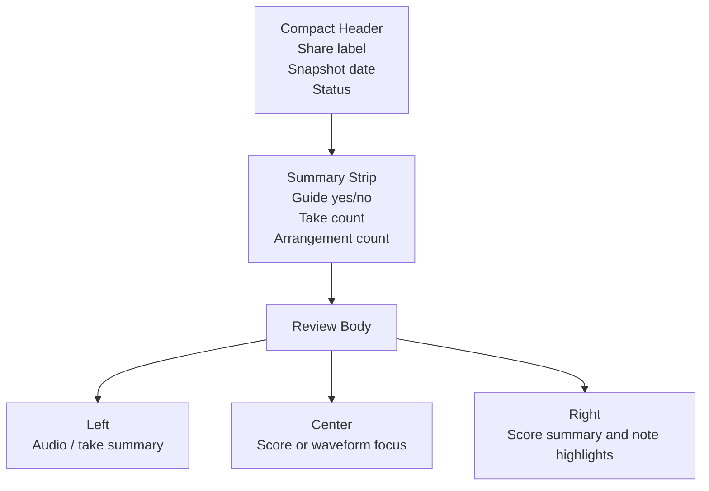
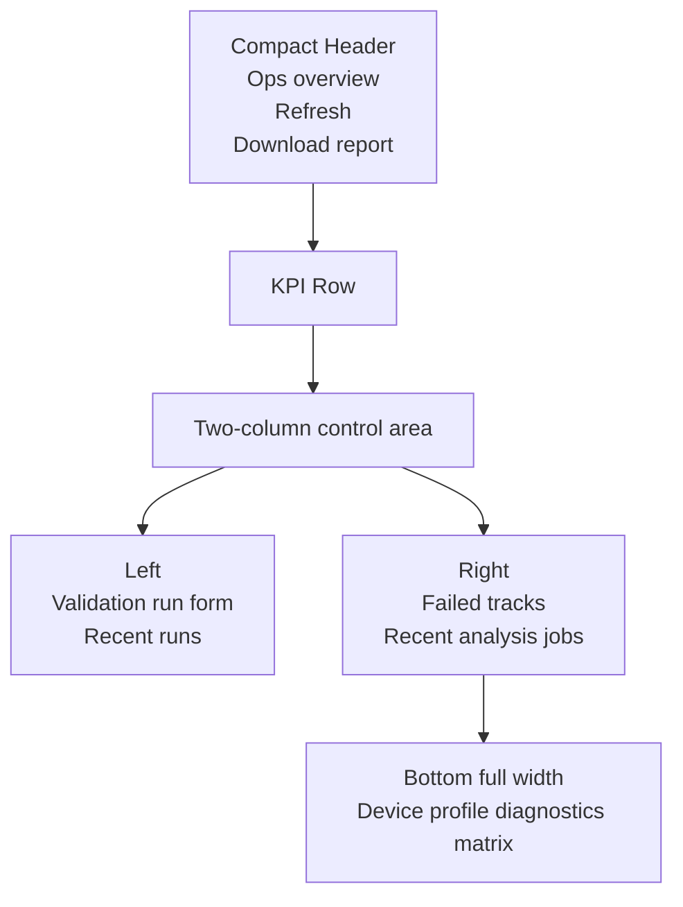

# GigaStudy UI Wireframes v1

Date: 2026-04-09
Status: Reference-led low-fidelity wireframe pack aligned to `DESIGN/UI_DESIGN_DIRECTION.md`.

## 0. Purpose

This document turns the chosen `Quiet Studio Console` direction into concrete screen wireframes.

Rule:

- follow the reference composition closely
- adapt the copy and product objects to GigaStudy
- keep these wireframes low fidelity on purpose

This is not a final visual spec.
It is the canonical layout pack for the next UI refactor.

## 1. Screen Set

This pack covers:

1. Home
2. Studio
3. Arrangement
4. Shared Review
5. Ops

## 2. Global Layout Rules

- App shell: dark graphite structural frame
- Main content surfaces: warm light canvases
- Accent: copper for transport and primary action
- Audio overlays: muted cyan
- Home: poster-like first screen
- Studio: integrated console, not stacked cards
- Arrangement: score-first composition
- Ops: dense utility layout

## 3. Home Wireframe

Reference lean:

- Notion Calendar for poster-like hero and integrated polish
- Linear for restraint and scan clarity

Primary message:

- Guided vocal practice with post-recording feedback and arrangement output

Suggested hero copy:

- Eyebrow: `GigaStudy Vocal Studio`
- Headline: `Record the take. Review the pitch. Build the harmony.`
- Body: `A web studio for guided vocal practice, note-level feedback, editable melody draft extraction, and 4 to 5-part arrangement export.`
- Primary CTA: `Start a Practice Project`
- Secondary CTA: `Open Demo Studio`



Desktop wireframe:

```text
+--------------------------------------------------------------------------------------------------+
| GigaStudy | Product | Studio | Docs | Sign In                                                   |
+--------------------------------------------------------------------------------------------------+
| GigaStudy Vocal Studio                                                                          |
| Record the take. Review the pitch. Build the harmony.                                          |
| A web studio for guided vocal practice, note-level feedback, editable melody draft extraction, |
| and 4 to 5-part arrangement export.                                                            |
| [ Start a Practice Project ]   [ Open Demo Studio ]                                            |
|                                                                                                 |
|                                              [ Large visual: waveform + contour + score crop ]  |
+--------------------------------------------------------------------------------------------------+
| Guided recording      | Note-level review      | Arrangement candidates                          |
+--------------------------------------------------------------------------------------------------+
| Upload guide -> Record take -> Review weak notes -> Export MusicXML / MIDI / guide WAV         |
+--------------------------------------------------------------------------------------------------+
| [ Product proof strip with one studio screenshot and 3 compact captions ]                      |
+--------------------------------------------------------------------------------------------------+
| Start a Practice Project                                                                        |
+--------------------------------------------------------------------------------------------------+
```

## 4. Studio Wireframe

Reference lean:

- Ableton Arrangement View for timeline and transport hierarchy
- Descript for center workspace plus right inspector
- Linear for calm density
- Filmora for clearer separation between source rack, preview player, timeline, and property inspector

Primary message:

- one integrated rehearsal console

Key rule:

- this screen should stop reading as stacked panels
- the next mockup pass may move more guide and take context into a Filmora-like left source rack, as long as the musical language stays primary



Desktop wireframe:

```text
+-------------------------------------------------------------------------------------------------------------------+
| Project: Morning Warmup | 92 BPM | Key C | Chords ready | Count-in 2 bars | Mic ready | Alignment confidence n/a |
+-------------------------------------------------------------------------------------------------------------------+
|                                                                                     | Inspector                   |
| Main Canvas                                                                         |-----------------------------|
|-------------------------------------------------------------------------------------| Pitch 86                    |
| [ waveform ]                                                                        | Rhythm 91                   |
| [ contour ]                                                                         | Harmony 79                  |
| [ target-note overlay ]                                                             | Quality mode: Note-level    |
| [ moving playhead ]                                                                 | Harmony mode: Chord-aware   |
|                                                                                     |-----------------------------|
|                                                                                     | Weak note: A4               |
|                                                                                     | Attack: +24c sharp          |
|                                                                                     | Sustain: +6c               |
|                                                                                     | Confidence: 93%             |
|                                                                                     | Message: Started sharp      |
+-------------------------------------------------------------------------------------------------------------------+
| Transport + Track Lane                                                                                             |
| [Record] [Stop] [Play guide] [Metronome] [Count-in]                                                               |
| Guide  | mute | solo | vol | ready | guide.wav                                                                    |
| Take 1 | mute | solo | vol | scored | selected                                                                    |
| Take 2 | mute | solo | vol | ready                                                                                |
+-------------------------------------------------------------------------------------------------------------------+
| Lower work rail: Melody Draft | Arrangement Candidates | Mixdown | Version History | Share Links                |
+-------------------------------------------------------------------------------------------------------------------+
```

## 5. Arrangement Wireframe

Reference lean:

- score-first artifact view from notation tools
- Ableton-like transport awareness
- Notion-like calm polish for secondary rails
- Filmora for a stronger candidate-source rail plus contextual right-side property discipline

Primary message:

- compare, listen, and export harmony from one score-centered screen

Suggested section copy:

- Heading: `Choose the harmony stack that fits the take`
- Subcopy: `Compare candidate voicing, preview the arrangement, then export the score package.`



Desktop wireframe:

```text
+---------------------------------------------------------------------------------------------------------------+
| Candidate A | Candidate B | Candidate C | Project: Morning Warmup | Preview [Play] [Stop] [01:24]         |
+---------------------------------------------------------------------------------------------------------------+
| Left Rail                            | Score Canvas                                           | Right Rail |
|--------------------------------------|--------------------------------------------------------|------------|
| Style: Contemporary                  | [ large score paper ]                                  | Lead solo  |
| Difficulty: Basic                    | [ OSMD render ]                                        | Alto solo  |
| Voice range: Alto                    | [ playhead ]                                           | Tenor solo |
| Beatbox: Pulse                       |                                                        | Bass solo  |
|--------------------------------------|                                                        |------------|
| Candidate compare                    |                                                        | Guide mode |
| Lead fit: 94%                        |                                                        | Part volume|
| Max leap: 5 semitones                |                                                        |------------|
| Parallel alerts: 1                   |                                                        | Export XML |
| Beatbox hits: 12                     |                                                        | Export MIDI|
|                                      |                                                        | Guide WAV  |
+---------------------------------------------------------------------------------------------------------------+
```

## 6. Shared Review Wireframe

Reference lean:

- simplified editorial presentation
- no edit ambiguity

Primary message:

- this is a frozen review artifact, not the working studio

Suggested copy:

- Heading: `Shared studio snapshot`
- Subcopy: `Review the selected take, score, and arrangement without editing controls.`



Desktop wireframe:

```text
+--------------------------------------------------------------------------------------------------+
| Shared studio snapshot | Coach review | Captured Apr 9, 2026 | Read-only                        |
+--------------------------------------------------------------------------------------------------+
| Guide: Yes | Takes: 3 | Ready takes: 2 | Arrangements: 2 | Mixdown: Yes                      |
+--------------------------------------------------------------------------------------------------+
| Audio Summary                      | Review Canvas                         | Score Summary                    |
|------------------------------------|---------------------------------------|----------------------------------|
| Selected take: Take 2              | [ score or waveform focus ]           | Pitch 84                         |
| Alignment confidence: 88%          | [ playhead / playback ]               | Rhythm 90                        |
| Melody draft: ready                |                                       | Harmony 78                       |
|                                    |                                       | Note highlight: started sharp    |
+--------------------------------------------------------------------------------------------------+
| [ Open guide audio ] [ Open arrangement MIDI ] [ Open MusicXML ]                                |
+--------------------------------------------------------------------------------------------------+
```

## 7. Ops Wireframe

Reference lean:

- Linear-like density
- no poster hero
- pure operator utility

Primary message:

- inspect environment and job risk quickly

Key rule:

- ops should not set the aesthetic tone for the rest of the product



Desktop wireframe:

```text
+-----------------------------------------------------------------------------------------------------+
| Ops Overview | Refresh | Download environment report | Last sync 09:40                               |
+-----------------------------------------------------------------------------------------------------+
| Failed tracks 3 | Failed analysis 1 | Warning profiles 8 | Browsers 4 | Native validations 2         |
+-----------------------------------------------------------------------------------------------------+
| Validation Run Form                              | Failed Tracks / Recent Jobs                      |
|--------------------------------------------------|--------------------------------------------------|
| Browser | OS | Device | PASS/WARN/FAIL           | Track 1 failed canonical processing              |
| Permission | Recording | Playback | Notes        | Job 7 retry available                            |
| [ Save validation run ]                          | [ Retry processing ] [ Retry analysis ]          |
+-----------------------------------------------------------------------------------------------------+
| Device Profile Diagnostics Matrix                                                                  |
| Browser | OS | secure context | mic permission | recorder mime | offline audio | warning flags        |
+-----------------------------------------------------------------------------------------------------+
```

## 8. Implementation Order

1. Home refactor
2. Studio shell refactor
3. Arrangement score-first refactor
4. Shared review cleanup
5. Ops density cleanup

## 9. Foundation Rule

If the eventual implemented screen intentionally diverges from these wireframes, update this document and `DESIGN/UI_DESIGN_DIRECTION.md` in the same change.
