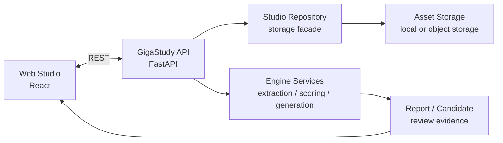

# GigaStudy

GigaStudy는 한 사람이 6성부 아카펠라 편곡을 만들고, 듣고, 연습하고, 평가할 수 있게 하는 웹 스튜디오입니다. Soprano, Alto, Tenor, Baritone, Bass, Percussion이 하나의 BPM/meter grid 위에 놓이고, 사용자는 이를 하나의 ensemble로 확인합니다.

이 저장소는 공개 가능한 소스와 제품 문서를 담은 public repo입니다. 실제 개발 history, alpha 운영 credential, 업로드된 음원, 비공개 실험 데이터는 `GigaStudy-private`에서 관리합니다.

## 제품 정의

GigaStudy는 악보 조판기가 아니라 연습 중심의 shared timeline studio입니다. PDF, MIDI, MusicXML, 직접 녹음, 파일 업로드, AI 생성 결과는 모두 같은 product model로 들어옵니다.

```text
Studio -> Track -> Region -> PitchEvent / AudioClip -> Playback / Practice / Scoring
```

이 모델을 지키기 위해 public product truth는 `Studio.regions`, `ArrangementRegion`, `PitchEvent`로 둡니다. 내부 extraction event나 scoring shadow가 존재하더라도 사용자에게 보이는 두 번째 timeline이 되어서는 안 됩니다.

## 핵심 사용자 흐름

1. BPM과 meter를 가진 studio를 만든다.
2. 여섯 track slot 중 필요한 곳에 녹음, 업로드, 문서 import, AI generation material을 등록한다.
3. 애매한 extraction/generation 결과는 candidate로 검토한 뒤 승인한다.
4. region lane과 piano roll에서 timing, pitch, duration을 조정한다.
5. 선택 track을 재생하고, reference track을 들으며 practice waterfall에서 연습한다.
6. 자신의 attempt를 녹음하고 pitch/rhythm/harmony report를 확인한다.
7. 부족한 part를 AI generation candidate로 보완한다.

## 주요 기능

| 영역 | 기능 |
| --- | --- |
| Studio 생성 | 빈 studio 또는 score file 기반 seed 생성 |
| Material 등록 | 녹음, direct upload, MIDI/MusicXML/PDF import, AI generation |
| Candidate review | 불확실한 material을 등록 전 검토하고 target track을 조정 |
| Arrangement edit | region lane, selected-region piano roll, session draft, bounded restore |
| Playback | 선택 track 동시 재생, guide tone synthesis, metronome/count-in |
| Practice | waterfall timing stage, reference track 기반 연습 |
| Scoring | answer scoring, harmony scoring, report history, report detail deep-link |
| Admin/operations | alpha studio 관리, resource tool, storage cleanup, guide tone sample 교체 |

## 기술 스택

| 영역 | 기술 |
| --- | --- |
| Web | React, Vite, TypeScript, PWA shell |
| API | FastAPI, Python, uv, Pydantic |
| Audio / Music | pitch event engine, guide tone synthesis, region normalization, scoring engine |
| Storage | local storage abstraction, optional Postgres metadata, optional S3/R2 assets |
| Test | pytest, Playwright, web build/lint/typecheck |
| Deploy | Cloud Run API, Cloudflare Pages/R2 alpha 운영 기준 |

## 아키텍처 개요



## 저장소 구조

```text
GigaStudy
+-- apps/web                # React client, studio/practice/report surfaces
+-- apps/api                # FastAPI service, domain services, schemas, tests
+-- e2e                     # Playwright smoke tests
+-- ops                     # alpha deploy/env templates
+-- PROJECT_FOUNDATION      # 제품 목적, 아키텍처, 운영 원칙, 작업 프로토콜
+-- tests                   # cross-cutting 검증
+-- cloudbuild.api.yaml     # Cloud Run API build 기준
\-- package.json            # workspace scripts
```

## 로컬 실행

```bash
npm install
cd apps/api
uv sync
uv run uvicorn gigastudy_api.main:app --reload --app-dir src
npm run dev:web
```

## 검증 명령

```bash
cd apps/api
uv run pytest
npm run build:web
npm run lint:web
npm run test:e2e
```

## 문서 기준

작업 시작 전에는 `PROJECT_FOUNDATION/WORKING_PROTOCOL.md`와 `PROJECT_FOUNDATION/OPERATING_PRINCIPLES.md`를 확인합니다. 제품 목적과 기능 범위는 `PROJECT_FOUNDATION/PRODUCT_PURPOSE_AND_FUNCTIONS.md`, 현재 runtime 구조는 `PROJECT_FOUNDATION/CURRENT_ARCHITECTURE.md`가 기준입니다.

## 공개 범위

public repo에는 공개 가능한 application source와 제품/운영 문서만 둡니다. 다음 항목은 포함하지 않습니다.

- alpha password, admin token, R2/S3 credential, AI provider key
- 업로드된 음원, 사용자 녹음, private sample data
- 실제 운영 storage, local `.env`, 배포 credential
- private 개발 history와 실험 로그

개발과 배포 기준은 private repo에서 이어가고, 이 public repo는 제품 의도와 공개 가능한 구현을 보여주는 spec surface로 관리합니다.
