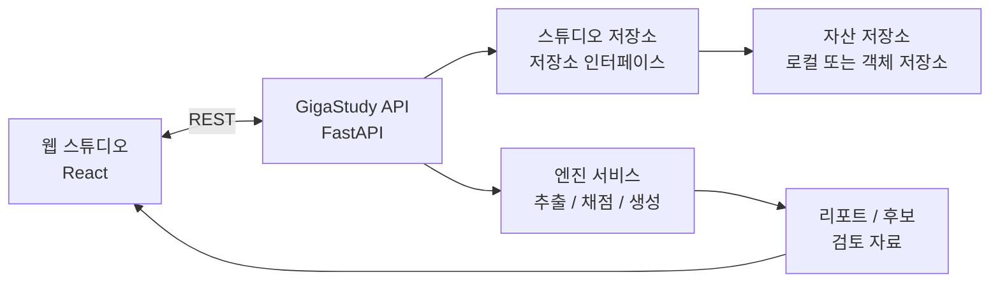

# GigaStudy

GigaStudy는 한 사람이 6성부 아카펠라 편곡을 만들고, 듣고, 연습하고, 평가할 수 있게 하는 웹 스튜디오입니다. Soprano, Alto, Tenor, Baritone, Bass, Percussion이 하나의 BPM/박자 격자 위에 놓이고, 사용자는 이를 하나의 앙상블로 확인합니다.

이 저장소는 공개 가능한 소스와 제품 문서를 담은 공개 저장소입니다. 실제 개발 이력, alpha 운영 인증 정보, 업로드된 음원, 비공개 실험 데이터는 `GigaStudy-private`에서 관리합니다.

## 커리어 근거로 읽는 법

| 항목 | 내용 |
| --- | --- |
| 프로젝트 유형 | 개인 제품형 프로젝트 |
| 내 역할 | 풀스택 개발, API/음악 이벤트 모델링, AI 기능 검증 기준 정리 |
| 주력 기술 | FastAPI, React, TypeScript, Cloud Run, R2, PyMuPDF, librosa, LLM planning |
| 보여주고 싶은 역량 | 복잡한 음악 입력을 하나의 제품 모델과 검증 가능한 백엔드 계약으로 정리하는 역량 |
| 대표 근거 | `PRODUCT_PURPOSE_AND_FUNCTIONS.md`, `CURRENT_ARCHITECTURE.md`, `EVALUATION_METRICS.md`, `AI_HARMONY_GENERATION_DESIGN.md` |

제가 이 프로젝트에서 강조하고 싶은 부분은 음악 AI를 "그럴듯하게 생성"하는 것이 아니라, **PDF/MIDI/MusicXML/녹음/AI 후보가 같은 기준 타임라인을 공유하도록 만든 제품 모델링**입니다. `Studio -> Track -> Region -> PitchEvent` 계약을 중심에 두고 재생, 연습, 채점, 생성이 서로 다른 답을 내지 않도록 정리했습니다.

## 제품 정의

GigaStudy는 악보 조판기가 아니라 연습 중심의 공유 타임라인 스튜디오입니다. PDF, MIDI, MusicXML, 직접 녹음, 파일 업로드, AI 생성 결과는 모두 같은 제품 모델로 들어옵니다.

```text
Studio -> Track -> Region -> PitchEvent / AudioClip -> Playback / Practice / Scoring
```

이 모델을 지키기 위해 공개 기준 모델은 `Studio.regions`, `ArrangementRegion`, `PitchEvent`로 둡니다. 내부 추출 이벤트나 채점 보조 데이터가 존재하더라도 사용자에게 보이는 두 번째 타임라인이 되어서는 안 됩니다.

## 핵심 사용자 흐름

1. BPM과 박자를 가진 스튜디오를 만든다.
2. 여섯 트랙 슬롯 중 필요한 곳에 녹음, 업로드, 문서 가져오기, AI 생성 자료를 등록한다.
3. 애매한 추출/생성 결과는 후보로 검토한 뒤 승인한다.
4. 구간 레인과 피아노롤에서 타이밍, 음정, 길이를 조정한다.
5. 선택 트랙을 재생하고, 기준 트랙을 들으며 연습 단계 화면에서 연습한다.
6. 자신의 시도를 녹음하고 음정/리듬/화음 리포트를 확인한다.
7. 부족한 파트를 AI 생성 후보로 보완한다.

## 주요 기능

| 영역 | 기능 |
| --- | --- |
| 스튜디오 생성 | 빈 스튜디오 또는 악보 파일 기반 seed 생성 |
| 자료 등록 | 녹음, 직접 업로드, MIDI/MusicXML/PDF 가져오기, AI 생성 |
| 후보 검토 | 불확실한 자료를 등록 전 검토하고 목표 트랙을 조정 |
| 편곡 편집 | 구간 레인, 선택 구간 피아노롤, 세션 초안, 제한된 복원 |
| 재생 | 선택 트랙 동시 재생, 가이드 톤 합성, 메트로놈/카운트인 |
| 연습 | 단계별 타이밍 화면, 기준 트랙 기반 연습 |
| 채점 | 정답 채점, 화음 채점, 리포트 이력, 리포트 상세 연결 |
| 관리/운영 | alpha 스튜디오 관리, 리소스 도구, 저장소 정리, 가이드 톤 샘플 교체 |

## 기술 스택

| 영역 | 기술 |
| --- | --- |
| 웹 | React, Vite, TypeScript, PWA shell |
| API | FastAPI, Python, uv, Pydantic |
| 오디오/음악 | 음정 이벤트 엔진, 가이드 톤 합성, 구간 정규화, 채점 엔진 |
| 저장소 | 로컬 저장소 추상화, 선택적 Postgres 메타데이터, 선택적 S3/R2 자산 |
| 테스트 | pytest, Playwright, 웹 빌드/lint/typecheck |
| 배포 | Cloud Run API, Cloudflare Pages/R2 alpha 운영 기준 |

## 아키텍처 개요



## 저장소 구조

```text
GigaStudy
+-- apps/web                # React 클라이언트, 스튜디오/연습/리포트 화면
+-- apps/api                # FastAPI 서비스, 도메인 서비스, 스키마, 테스트
+-- e2e                     # Playwright 기본 검증
+-- ops                     # alpha 배포/환경 템플릿
+-- PROJECT_FOUNDATION      # 제품 목적, 아키텍처, 운영 원칙, 작업 프로토콜
+-- tests                   # 공통 검증
+-- cloudbuild.api.yaml     # Cloud Run API build 기준
\-- package.json            # 작업공간 스크립트
```

## 로컬 실행

```bash
npm install
cd apps/api
uv sync
uv run uvicorn gigastudy_api.main:app --reload --app-dir src
npm run dev:web
```

## 검증 명령

```bash
cd apps/api
uv run pytest
npm run build:web
npm run lint:web
npm run test:e2e
```

## 문서 기준

작업 시작 전에는 `PROJECT_FOUNDATION/WORKING_PROTOCOL.md`와 `PROJECT_FOUNDATION/OPERATING_PRINCIPLES.md`를 확인합니다. 제품 목적과 기능 범위는 `PROJECT_FOUNDATION/PRODUCT_PURPOSE_AND_FUNCTIONS.md`, 현재 실행 구조는 `PROJECT_FOUNDATION/CURRENT_ARCHITECTURE.md`가 기준입니다.

## 공개 범위

공개 저장소에는 공개 가능한 애플리케이션 소스와 제품/운영 문서만 둡니다. 다음 항목은 포함하지 않습니다.

- alpha 비밀번호, 관리자 토큰, R2/S3 인증 정보, AI 공급자 키
- 업로드된 음원, 사용자 녹음, 비공개 샘플 데이터
- 실제 운영 저장소, local `.env`, 배포 인증 정보
- 비공개 개발 이력과 실험 로그

개발과 배포 기준은 비공개 저장소에서 이어가고, 이 공개 저장소는 제품 의도와 공개 가능한 구현을 보여주는 기획 명세 표면으로 관리합니다.
